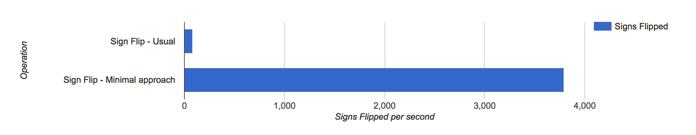
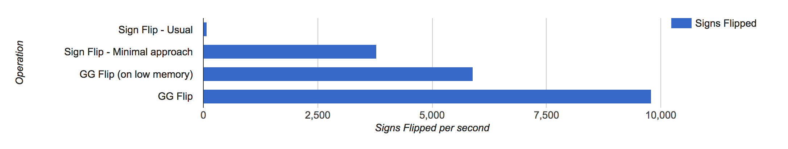

# GG Flip

Donald Knuth described in one of his TAOCP books that flipping the sign of a number is one of the hardest problems in Computer Science. But that was in the 60s. Thanks to years of research and after numerous publications, today have some interesting ways to do the same. Consider this:

```javascript
x = 5
// get -5
x -= x*2;
```

Above is one of the simplest and most efficient ways to flip the sign of a number. It uses the 'minimal' approach and there is now a [popular npm library](https://github.com/avinassh/sign-flip) based on it. It actually works and is highly performant:



But as you can see, in today's webscale world flipping ~4000 signs per second wouldn't cut it. I started to look into the ways to improve it and started reading the code of V8 engine. My C is rusty, but I was able to read through most of the code and understand it. Turns out V8 highly optimises the switch blocks and they are faster compared to any other control statements. I decided to make use of this and implement a better sign flip. GG Flip is the result.

GG Flip is a Golang library which generates the Javascript sign flip library. I preferred Go because lack of generics seemed like a good design choice. This code has no external dependencies, you can run:

```
git clone https://github.com/avinassh/gg-flip.git
cd gg-flip
go run main.go
```

Above code generates highly readable file `lib.js`, which is:

```javascript
function signFlip(num) {
    switch (num) {
        case 0:
            return -0;
        case -0:
            return 0;
        case 1:
            return -1;
        case -1:
            return 1;
        // ...
        case 9:
            return -9;        
        case -9:
            return 9;
        // ...
        case 9007199254740991:
            return -9007199254740991;
        case -9007199254740991:
            return 9007199254740991;
        default:
            return num-num*2;
    }
}
```

Thanks to V8 and their clever switch block optimizations, the above code becomes highly performant. If the jumps in switch take a long time, then it fallbacks to the default, which flips the sign using minimal approach. It's a win-win! See the performance by yourself:



Even in low memory environments (old computers, internet explorer, iPhones with low battery), GG Flip performs almost twice as fast compared to the minimal approach and in the usual environments, it's almost 10x faster than the usual method and 4x faster than the minimal approach. Currently, GG Flip works only with the integers and for floats, it fallbacks to default switch case. In the next version, I will include all the float numbers, so that for floats also the performance remains same.

The final lib size is few GBs, so distribution may become a problem. But I am talking with popular CDN providers like Google, Cloudflare etc to ship this library directly. I am planning to send a PR to Javascript with this library so that GG Flip comes as a standard library as part of the glorious language.

I am also exploring Blockchain to see if this library can be distributed securely and quickly, to everyone. Bitcoin Cash which is a fork of Bitcoin, uses 4MB per blocks and hence might be a good candidate to distribute the GG Flip.

## GG Flip as a Service

I am now providing GG Flip as a web service, check - [GaS](https://avi.im/gg-flip/). Now, with a simple API request, you can flip the sign of numbers and get all the benefits. GaS is hosted on Cloud and hence is very fast.

## License

The mighty MIT license. Please check `LICENSE` for more details.
